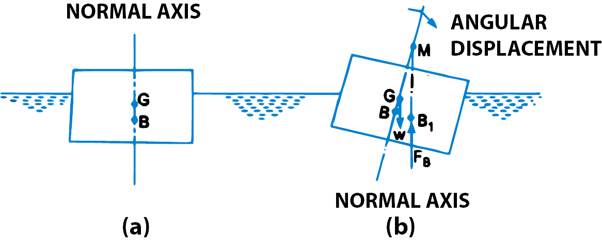
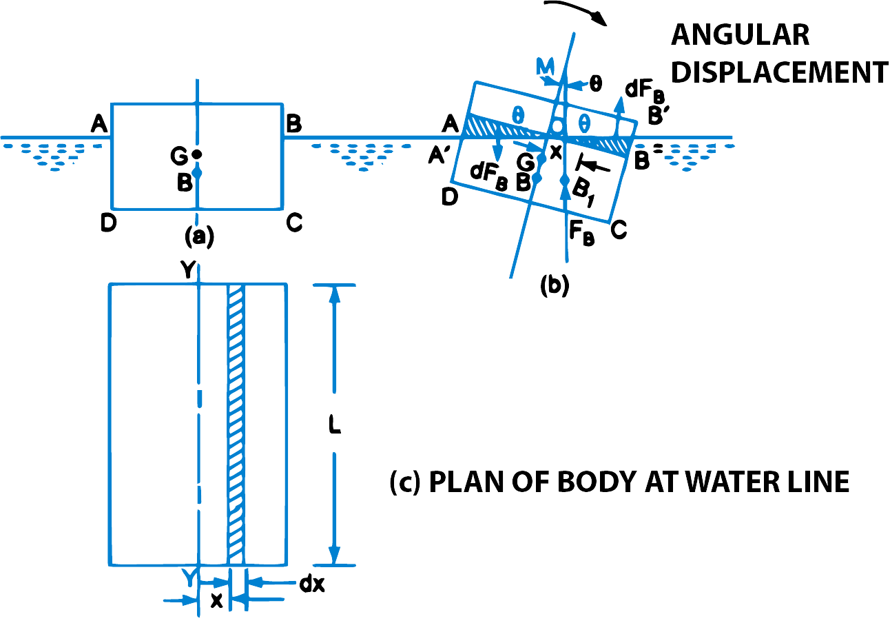

<h2>1. META-CENTRE</h2>

It is defined as the point about which a body starts oscillating when the body is tilted by a small angle. The meta-centre may also be defined as the point at which the line of action of the force of buoyancy will meet the normal axis of the body when the body is given a small angular displacement.

$$ fig.\ 1\ \ \ \ Meta\ centre$$

<h2>2. ANALYTICAL METHOD FOR META-CENTRE HEIGHT</h2>

Fig. 2 (a) shows the position of a floating body in equilibrium. The location of the centre of gravity and centre of buoyancy in this position is at G and B. The floating body is given a small angular displacement in the clockwise direction. This is shown in fig. 2 (b). The new centre of buoyancy is at B1. The vertical line through B1 cuts the normal axis at M. Hence M is the meta-centre and GM is meta-centric height.

$$ fig.\ 2\ \ \ \ Meta\ centre\ height\ of\ floating\ body$$

<B>Coupled Due to Wedges.</B> Consider towards the right of the axis a small strip of thickness dx at a distance x from O as shown in fig. 1(b). The height of strip <i>x</i> &times; &ang;BOB' = <i>x</i> &times; &theta;. {&#8757; &ang;BOB' = &ang;AOA' = &ang;BMB'1 = &theta;}

   $$ ∴ Area\ of\ strip = Height × Thickness = x × θ × dx $$

If L is the length of the floating body, then

$$ Volume\ of\ strip = Area × L $$
$$ = x × θ × L × dx $$
$$ ∴ Weight\ of\ strip = ρg × Volume = ρgx\ θL\ dx $$

Similarly, if a small strip of thickness dx  at a distance x from O towards the left of the axis is considered, the weight of strip will be $ ρgx\ θL\ dx $. The two weights are acting in the opposite direction and hence constitute a couple.

$$ Moment\ of\ this\ couple = Weight\ of\ each\ strip\ × Distance\ between\ these\ two\ weights $$
$$ = ρgx\ θL\ dx [x+x] $$
$$ = ρgx\ θL\ dx × 2x $$
$$ = 2ρgx^2θLdx $$

&therefore; Moment of the couple for the whole wedge
$$ = ∫2ρgx^2θLdx \quad \quad \quad \quad \quad \quad ...equ(1)$$

Moment of couple due to shifting of centre of buoyancy from B to B1
$$ = F_B × BB_1 $$
$$ = F_B × BM × θ \quad \quad \{∵ BB_1 = BM × θ\ \ if\ \ θ\ is\ very\ small  \} $$
$$ = W × BM × θ  \quad \quad \{∵ F_B = W \} \quad \quad \quad \quad\quad \quad ...equ(2)  $$

But these two couples are the same. Hence equating equations (1) and (2), we get
$$ W × BM × θ  = ∫2ρgx^2θLdx $$
$$ W × BM × θ = 2ρgθ ∫ x^2Ldx $$
$$ W × BM = 2ρg ∫ x^2Ldx $$

Now Ldx = Elemental area on the water line shown in fig. 2(c) and = dA
$$ ∴  \quad \quad W × BM = 2ρg ∫ x^2dA $$

But from fig. 1(c) it is clear that 2∫x2 dA is the second moment of area of the plan of the body at water surface about the axis Y-Y. Therefore
$$ W × BM = ρgI \quad \quad \quad \{where\ I = 2∫x^2dA \} $$
$$ ∴ BM = \frac{ρgI}{W} $$

But
$$ W = Weight\ of\ the\ body $$
$$ = Weight\ of\ the\ fluid\ displaced\ by\ the\ body $$
$$ = ρg × Volume\ of\ the\ fluid\ displaced\ by\ the\ body $$
$$ = ρg × Volume\ of\ the\ body\ sub\ merged\ in\ the\ water $$
$$ = ρg × ∀  $$
$$ ∴ BM = \frac{ρg × I}{ρg × ∀ } = \frac{I}{∀ } \quad \quad \quad \quad \quad \quad ...equ(3) $$
$$ GM = BM - BG = \frac{I}{∀} - BG $$
$$ ∴ Meta\ centric\ height = GM = \frac{I}{∀} - BG \quad \quad \quad \quad \quad \quad ...equ(4) $$